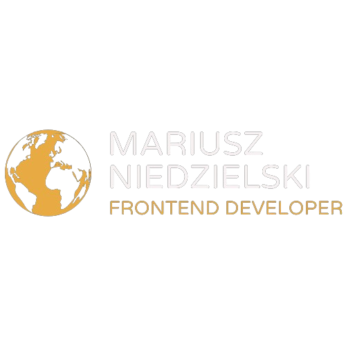
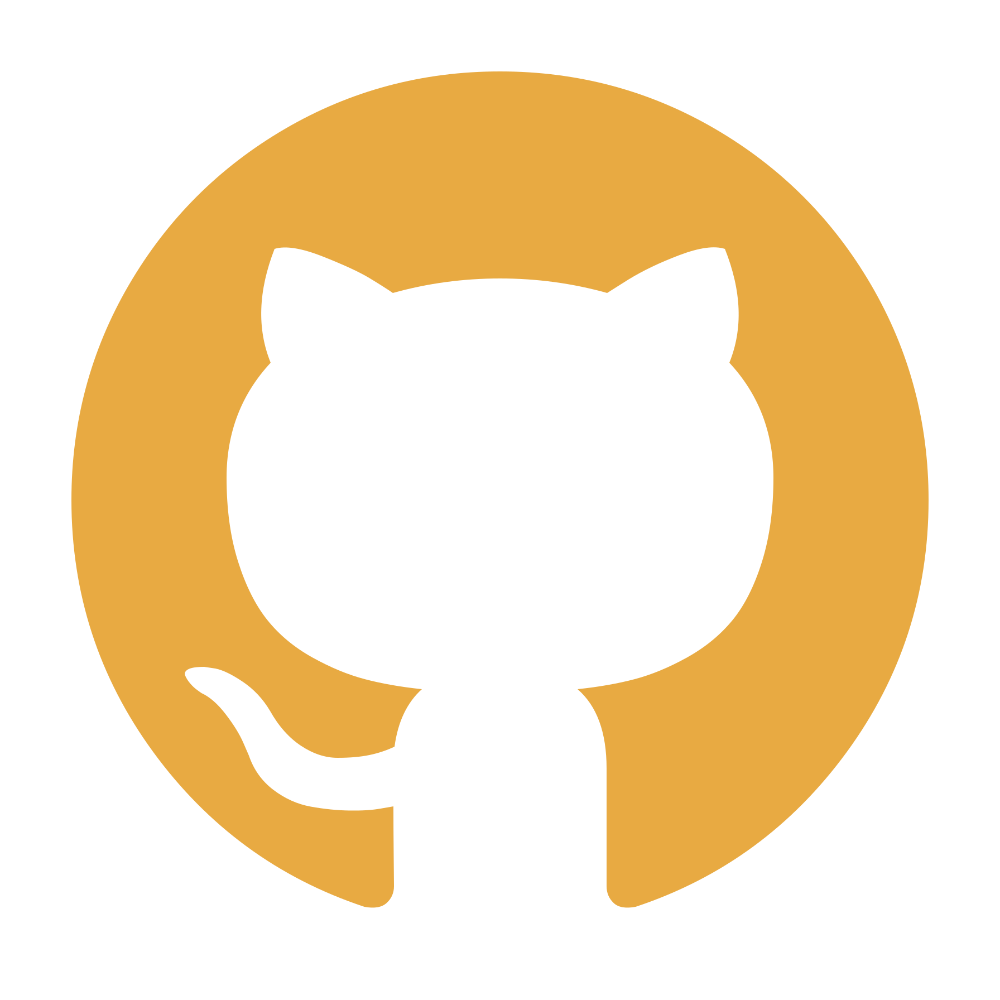

## Hello there 👋!

### I'm Mariusz, a Junior Frontend Developer based in Zielona Góra, Poland.

▪️I'm ambitious, determined and communicative
person. Always do my job with passion!
 
 
▪️I appreciate a great sense of humor, yet professionalism in
the team I work with. 😁
 
 
▪️Currently I'm improving my skills in web
development. Working especially with ReactJS library
brings me the most fun. 
 
 
▪️I’m no stranger to demanding tasks and challenges and
and always curious about new solutions.
 
 
⭐⭐⭐ If you want to learn more about me, then have a look at my [portfolio website](https://mariuszniedzielski.pl). Cheers! ⭐⭐⭐
 
 

## Let's work together!

### You can contact me via:

 

#

### Tech Stack:

 

#

### Projects:

🌐 My official [portfolio website](https://mariuszniedzielski.pl). Fully responsive website with detailed information
about myself.

 
<strong>Tech-stack used:</strong>: ReactJS, HTML5, CSS3, Styled
Components & EmailJS.
 

#

⚽ [what-a-strike](https://what-a-strike.netlify.app). Application displaying up-to-date results and standings of top 5 football leagues in the world. A project created to practice utilizing of JavaScript, along with the usage of Fetch API and BEM Methodology. Automated via the usage of GULP task runner.

Data on this website is powered by [football-data.org](https://www.football-data.org/).

 
<strong>Tech-stack used:</strong>: JavaScript, HTML5, CSS3, SASS.
 

#

📈 [The Creepto's](https://the-creeptos.netlify.app). Application displaying up-to-date rates of top cryptocurrencies. A project created to practice utilizing of JavaScript, along with the usage of Fetch API and BEM Methodology. Automated via the usage of GULP task runner.

Data on this website is powered by [coingecko.com](https://www.coingecko.com/).

 
<strong>Tech-stack used:</strong>: JavaScript, HTML5, CSS3, SASS.
 

#

💰 [My Money Mate](https://my-money-mate.netlify.app). Application tracking your incomes and expenses. A demonstration project created to practice utilizing of React JS including React Hooks and Context API. I've also added a backend API using Express and MongoDB, so that made it fullstack MERN application.

 
<strong>Tech-stack used:</strong>: ReactJS, HTML5, CSS3, MongoDB, ExpressJS, NodeJS.
 
